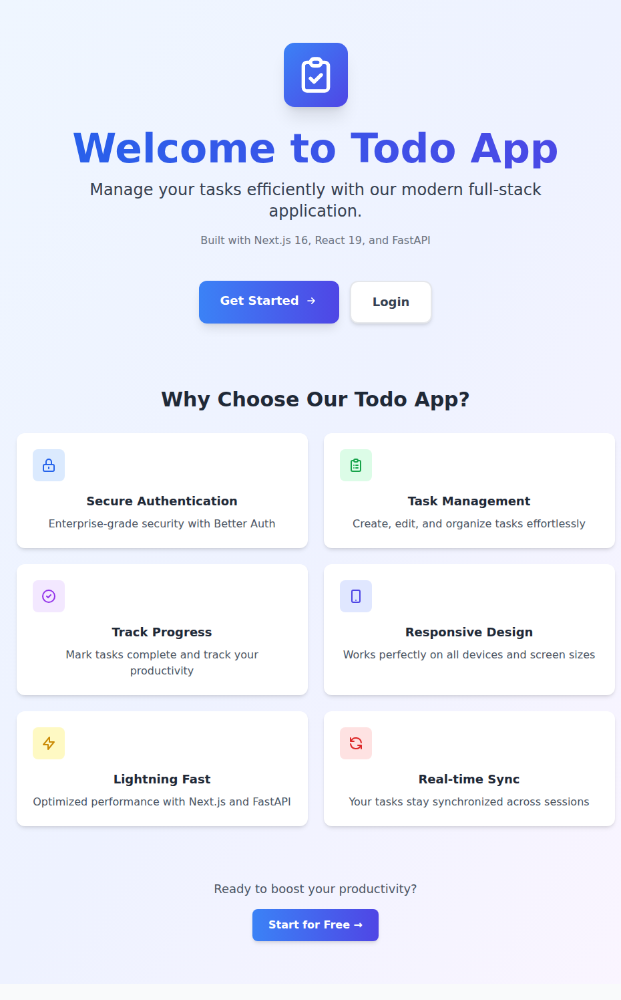
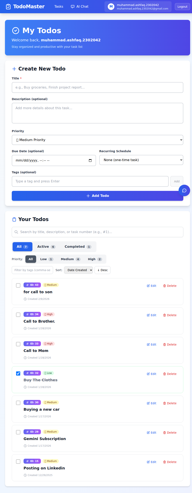

# Evolution of Todo - Hackathon II

> **From CLI to Cloud-Native**: A journey through Spec-Driven Development

## Live Application (Phase V - GKE)

| Service | URL |
|---------|-----|
| **Frontend** | [http://34.44.146.146](http://34.44.146.146) |
| **Backend API** | [http://34.57.215.48](http://34.57.215.48) |
| **API Docs** | [http://34.57.215.48/docs](http://34.57.215.48/docs) |





---

## Table of Contents

- [Project Overview](#project-overview)
- [All Five Phases](#all-five-phases)
- [Tech Stack](#tech-stack)
- [Phase I: CLI Todo App](#phase-i-cli-todo-app)
- [Phase II: Full-Stack Web Application](#phase-ii-full-stack-web-application)
- [Phase III: AI Chatbot with MCP Tools](#phase-iii-ai-chatbot-with-mcp-tools)
- [Phase IV: Local Kubernetes Deployment](#phase-iv-local-kubernetes-deployment)
- [Phase V: Cloud Deployment (GKE)](#phase-v-cloud-deployment-gke)
- [Architecture](#architecture)
- [Getting Started](#getting-started)
- [Development Workflow](#development-workflow)
- [Deployment](#deployment)
- [Testing](#testing)
- [Project Structure](#project-structure)
- [Learning Outcomes](#learning-outcomes)

---

## Project Overview

**Evolution of Todo** is a progressive full-stack application that demonstrates modern software engineering practices through **Spec-Driven Development (SDD)**. The project evolves from a simple command-line interface to a production-ready, cloud-native application deployed on Google Kubernetes Engine -- showcasing how AI agents like Claude Code can transform specifications into working software without manual coding.

### Key Highlights

- **Spec-Driven Development**: Every feature starts with a detailed specification in Markdown
- **AI-Generated Code**: 100% of the code was generated by Claude Code and Gemini
- **Test-Driven**: 82-85% test coverage across all phases
- **Cloud-Native**: Deployed on GKE with LoadBalancer services
- **Enterprise Security**: JWT authentication, user isolation, CORS
- **AI-Powered**: Gemini-based chatbot with MCP tools for natural language task management
- **Containerized**: Multi-stage Docker builds, Helm charts, Kubernetes orchestration

---

## All Five Phases

| Phase | Description | Status | Points | Key Tech |
|-------|-------------|--------|--------|----------|
| **Phase I** | In-Memory Python CLI App | Complete | 100 | Python 3.13, pytest |
| **Phase II** | Full-Stack Web Application | Complete | 150 | FastAPI, Next.js, Neon PostgreSQL |
| **Phase III** | AI Chatbot with MCP Tools | Complete | 200 + 300 bonus | Gemini AI, MCP, ChatKit |
| **Phase IV** | Local Kubernetes (Minikube) | Complete | -- | Docker, Helm, Minikube |
| **Phase V** | Cloud Deployment (GKE) | Complete | 300 | GKE, LoadBalancer, K8s Secrets |

### Deployment History

| Platform | URL | Phase |
|----------|-----|-------|
| **GKE (Current)** | [http://34.44.146.146](http://34.44.146.146) | Phase V |
| Vercel (Frontend) | hackathon-todo-fullstack.vercel.app | Phase II-III |
| Railway (Backend) | hackathon-todo-fullstack-backend-production.up.railway.app | Phase II-III |

---

## Tech Stack

### Phase I: CLI Application
- **Language**: Python 3.13+
- **Storage**: In-memory list
- **Testing**: pytest, pytest-cov (82% coverage)

### Phase II: Full-Stack Web Application

| Layer | Technology |
|-------|-----------|
| **Backend** | FastAPI 0.115+, SQLModel, Neon PostgreSQL |
| **Frontend** | Next.js 16, React 19, TypeScript 5, Tailwind CSS 4 |
| **Auth** | Better Auth (email/password + JWT in httpOnly cookies) |
| **Forms** | React Hook Form + Zod validation |
| **HTTP Client** | Axios with exponential backoff retry |
| **Deployment** | Railway (backend) + Vercel (frontend) |

### Phase III: AI Chatbot

| Layer | Technology |
|-------|-----------|
| **AI Provider** | Google Gemini 2.5 Flash |
| **Agent Framework** | OpenAI Agents SDK |
| **MCP Tools** | 5 tools (add, list, complete, update, delete tasks) |
| **Chat UI** | OpenAI ChatKit |
| **Voice** | Web Speech API |

### Phase IV: Local Kubernetes

| Layer | Technology |
|-------|-----------|
| **Containerization** | Docker (multi-stage builds) |
| **Orchestration** | Kubernetes (Minikube) |
| **Package Manager** | Helm 3.x |
| **AI DevOps** | kubectl-ai, Docker AI (Gordon) |

### Phase V: Cloud Deployment

| Layer | Technology |
|-------|-----------|
| **Cloud Platform** | Google Kubernetes Engine (GKE) |
| **Networking** | LoadBalancer services (frontend + backend) |
| **Secrets** | Kubernetes Secrets |
| **Images** | Docker Hub (ashfaq1192) |
| **Database** | Neon PostgreSQL (external) |

---

## Phase I: CLI Todo App

### Features
- Add tasks (title, description, priority)
- View tasks (sorted by priority, grouped by status)
- Mark tasks complete/incomplete
- Update and delete tasks
- Priority levels (High, Medium, Low)
- Colored CLI output

### Quick Start

```bash
cd phase-1-cli
uv venv && source .venv/bin/activate
uv add --dev pytest pytest-cov ruff
python src/main.py
```

---

## Phase II: Full-Stack Web Application

### Features
- User signup/login with Better Auth
- JWT authentication with httpOnly cookies
- Full CRUD task management with optimistic updates
- Password reset with email verification (Resend)
- Responsive design (mobile, tablet, desktop)
- Loading skeletons, toast notifications, error handling

### API Endpoints

| Method | Endpoint | Description |
|--------|----------|-------------|
| `GET` | `/api/{user_id}/tasks` | List all user tasks |
| `POST` | `/api/{user_id}/tasks` | Create new task |
| `PUT` | `/api/{user_id}/tasks/{id}` | Update task (full) |
| `PATCH` | `/api/{user_id}/tasks/{id}` | Update task (partial) |
| `DELETE` | `/api/{user_id}/tasks/{id}` | Delete task |

---

## Phase III: AI Chatbot with MCP Tools

### Features
- Natural language task management ("Add a task to buy groceries")
- 5 MCP tools for all CRUD operations
- Conversation history persistence in database
- Gemini 2.5 Flash as AI provider
- Voice input via Web Speech API

### Chat Examples

```
"Add a task to buy groceries"
"Show me my pending tasks"
"Mark task 3 as complete"
"Delete task 5"
"Update task 1, change title to 'Buy organic groceries'"
```

---

## Phase IV: Local Kubernetes Deployment

### Features
- Multi-stage Docker builds (frontend: ~350MB, backend: ~600MB)
- Helm chart with configurable values
- Health checks and readiness probes
- ConfigMaps and Secrets management
- Ingress controller for local access

### Quick Start

```bash
cd phase-4-k8s
minikube start --driver=docker --memory=4096 --cpus=2
minikube addons enable ingress
helm install todo-chatbot ./helm/todo-chatbot -f ./helm/todo-chatbot/values-minikube.yaml
kubectl port-forward svc/todo-chatbot-frontend 3000:3000
```

---

## Phase V: Cloud Deployment (GKE)

### Live URLs

| Service | URL |
|---------|-----|
| **Frontend** | [http://34.44.146.146](http://34.44.146.146) |
| **Backend** | [http://34.57.215.48](http://34.57.215.48) |

### Features
- GKE Standard Cluster with LoadBalancer services
- Docker images on Docker Hub (`ashfaq1192/todo-frontend:v4`, `ashfaq1192/todo-backend:v2`)
- Kubernetes Secrets for sensitive configuration
- CORS configured between frontend and backend LoadBalancer IPs
- Build-time environment injection via Docker `--build-arg`

### Key Lesson: Next.js NEXT_PUBLIC_* Variables

`NEXT_PUBLIC_*` variables are **baked into the JavaScript bundle at build time**.
Setting them via K8s ConfigMap/Secret at runtime has no effect on the browser.
The correct approach is using Docker `--build-arg`:

```bash
docker build \
  --build-arg NEXT_PUBLIC_API_URL=http://34.57.215.48 \
  --build-arg NEXT_PUBLIC_BETTER_AUTH_URL=http://34.44.146.146 \
  --build-arg BETTER_AUTH_URL=http://34.44.146.146 \
  --platform linux/amd64 \
  -t ashfaq1192/todo-frontend:v4 \
  -f phase-4-k8s/docker/frontend/Dockerfile \
  phase-3-chatbot/frontend
```

See [Phase V README](./phase-5-cloud-deployment/README.md) for the complete deployment guide.

---

## Architecture

### Phase V: Cloud Architecture (Current)

```
                        Internet
                           |
              +------------+------------+
              |                         |
              v                         v
   +-------------------+    +-------------------+
   | Frontend LB       |    | Backend LB        |
   | 34.44.146.146:80  |    | 34.57.215.48:80   |
   +-------------------+    +-------------------+
              |                         |
              v                         v
   +-------------------+    +-------------------+
   | Frontend Pod      |    | Backend Pod       |
   | Next.js 16        |    | FastAPI           |
   | Better Auth       |    | MCP Tools (5)     |
   +-------------------+    | Gemini AI         |
                            +-------------------+
                                       |
                                       v
                            +-------------------+
                            | Neon PostgreSQL   |
                            | (External DB)     |
                            +-------------------+
```

### Authentication Flow

```
User --> Frontend (Better Auth) --> Issues JWT in httpOnly cookie
  |
  +--> API requests include JWT in Authorization: Bearer header
  |
  +--> Backend validates JWT signature (shared secret)
  |
  +--> Extracts user_id, filters all DB queries (data isolation)
```

---

## Getting Started

### Prerequisites

- Python 3.13+ | Node.js 20+ | Docker | Git
- Neon PostgreSQL account ([neon.tech](https://neon.tech))

### Quick Start (Local Development)

```bash
# Clone
git clone https://github.com/ashfaq1192/hackathon-todo-fullstack.git
cd hackathon-todo-fullstack

# Backend
cd phase-3-chatbot/backend
uv sync
cp .env.example .env  # Edit with your DB URL, API keys
uvicorn src.main:app --reload --port 8000

# Frontend (new terminal)
cd phase-3-chatbot/frontend
npm install
cp .env.example .env.local  # Edit with your config
npm run dev
```

Open [http://localhost:3000](http://localhost:3000), sign up, and start managing tasks.

---

## Development Workflow

This project follows **Spec-Driven Development (SDD)**:

```
Specification (WHAT) --> Planning (HOW) --> Tasks (STEPS) --> Implementation (CODE)
```

**No manual coding allowed** -- only spec refinement and prompt engineering.

### Key Commands

| Command | Purpose |
|---------|---------|
| `/sp.specify` | Create feature specification |
| `/sp.plan` | Generate implementation plan |
| `/sp.tasks` | Break plan into atomic tasks |
| `/sp.implement` | Execute tasks (AI generates code) |

---

## Testing

### Backend (pytest)

```bash
cd phase-3-chatbot/backend
pytest --cov=src --cov-report=term-missing
# 85% coverage, 17+ tests passing
```

### Frontend (Vitest + Playwright)

```bash
cd phase-3-chatbot/frontend
npm run test           # Unit tests (Vitest)
npm run test:e2e       # E2E tests (Playwright)
# 14+ tests passing
```

---

## Project Structure

```
hackathon-todo-fullstack/
├── phase-1-cli/                   # Phase I: Python CLI Application
│   ├── src/
│   └── tests/
├── phase-2-fullstack/             # Phase II: Full-Stack Web App
│   ├── backend/                   # FastAPI
│   └── frontend/                  # Next.js
├── phase-3-chatbot/               # Phase III: AI Chatbot (active codebase)
│   ├── backend/                   # FastAPI + MCP + Gemini
│   └── frontend/                  # Next.js + ChatKit
├── phase-4-k8s/                   # Phase IV: Local Kubernetes
│   ├── docker/                    # Dockerfiles (frontend + backend)
│   ├── helm/                      # Helm charts
│   └── scripts/                   # Build/deploy scripts
├── phase-5-cloud-deployment/      # Phase V: GKE Cloud Deployment
│   ├── k8s/                       # K8s manifests
│   ├── dapr/                      # Dapr components
│   └── services/                  # Microservices
├── specs/                         # SDD Artifacts
│   ├── features/                  # Feature specifications
│   └── archive/                   # Historical specs by phase
├── history/prompts/               # Prompt History Records (PHRs)
├── .claude/skills/                # Claude Code skills (reusable knowledge)
├── CLAUDE.md                      # AI agent instructions
├── AGENTS.md                      # SDD workflow guide
└── README.md                      # This file
```

---

## Learning Outcomes

1. **Spec-Driven Development** -- Writing specs, breaking features into tasks, working with AI agents
2. **Full-Stack Architecture** -- RESTful APIs, JWT auth, database modeling, frontend state management
3. **AI Integration** -- MCP tools, agent frameworks, natural language interfaces
4. **Container Orchestration** -- Docker multi-stage builds, Helm charts, Kubernetes deployments
5. **Cloud Deployment** -- GKE, LoadBalancers, K8s Secrets, build-time vs runtime env vars
6. **DevOps** -- CI/CD, environment configuration, production debugging

---

## Acknowledgments

- **Hackathon Organizers**: Panaversity, PIAIC, GIAIC
- **Mentors**: Zia, Rehan, Junaid, Wania
- **AI Agents**: Claude Code (Opus 4.6) and Gemini
- **Spec Management**: Spec-Kit Plus

---

<div align="center">

**Built with Spec-Driven Development**

[](https://github.com/ashfaq1192/hackathon-todo-fullstack)

**Evolution of Todo** | Phase I-V Complete | Hackathon II 2024-2026

[Live App](http://34.44.146.146) | [API Docs](http://34.57.215.48/docs) | [Phase V Guide](./phase-5-cloud-deployment/README.md)

</div>
